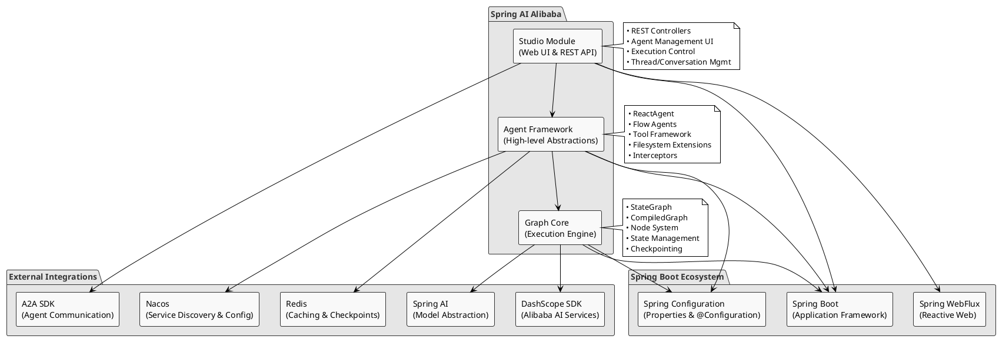
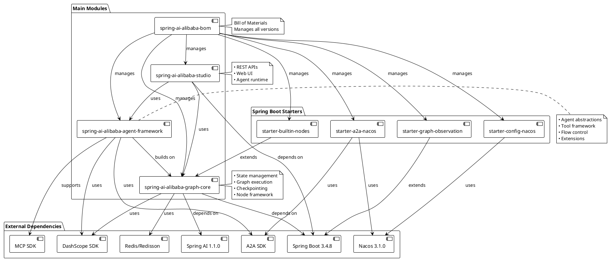
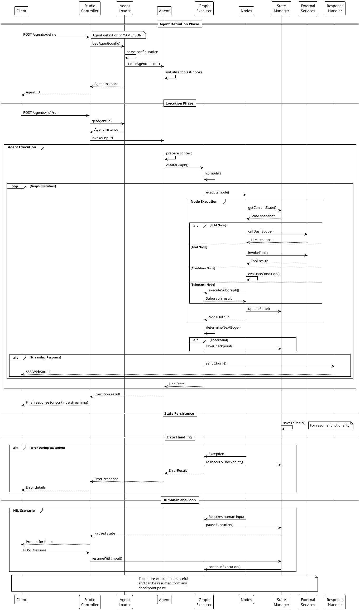
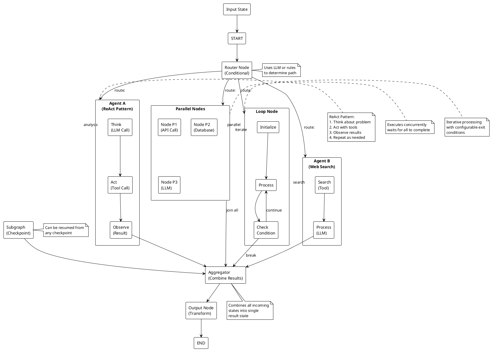

# Spring AI Alibaba - Complete Architecture Guide

This guide provides a comprehensive overview of the Spring AI Alibaba architecture, including detailed PlantUML visualizations.

## Table of Contents

1. [Architecture Overview](#architecture-overview)
2. [High-Level Architecture](#high-level-architecture)
3. [Module Dependencies](#module-dependencies)
4. [Agent Framework Classes](#agent-framework-classes)
5. [Execution Flow](#execution-flow)
6. [Graph Structure](#graph-structure)

## Architecture Overview

Spring AI Alibaba is a comprehensive framework for building AI-powered applications using Spring Boot. It integrates Alibaba's DashScope AI services and provides a declarative, configuration-driven approach to creating intelligent agents, workflows, and conversational applications.

### Core Modules

1. **spring-ai-alibaba-graph-core**: The foundational graph-based execution engine
2. **spring-ai-alibaba-agent-framework**: High-level agent abstractions and patterns
3. **spring-ai-alibaba-studio**: Web-based development and management interface
4. **Spring Boot Starters**: Convenient auto-configuration modules

## High-Level Architecture

**Key Points:**
- Layered architecture with clear separation of concerns
- Studio provides web interface for agent management
- Agent Framework builds on top of Graph Core
- Deep integration with Spring Boot ecosystem
- Extensive external integrations for AI, storage, and communication

## Module Dependencies

**Module Relationships:**
- BOM centrally manages all module versions
- Graph Core is the foundational layer
- Agent Framework builds upon Graph Core
- Studio uses both Core and Agent Framework
- Starters provide convenient Spring Boot integration

## Agent Framework Classes

```plantuml
@startuml Spring AI Alibaba - Agent Framework Classes
!theme plain
skinparam monochrome true
skinparam shadowing false
skinparam defaultFontName Arial

package "Core Agent Classes" {
    abstract class Agent {
        -String name
        -List<AgentTool> tools
        -ChatModel chatModel
        -Memory memory
        -List<Hook> hooks
        +invoke(String input): Flux<Message>
        +stream(String input): Flux<Message>
        #execute(): NodeOutput
    }

    abstract class BaseAgent {
        -Builder builder
        +Builder builder()
    }

    class ReactAgent {
        +ReactAgent(Builder builder)
        +static Builder builder(): Builder
    }

    Agent <|-- BaseAgent
    BaseAgent <|-- ReactAgent

    interface Builder {
        +name(String): Builder
        +tools(List<Tool>): Builder
        +chatModel(ChatModel): Builder
        +memory(Memory): Builder
        +hooks(List<Hook>): Builder
        +build(): Agent
    }

    Agent ..> Builder : uses
}

package "Flow Agents" {
    abstract class FlowAgent {
        -List<Agent> agents
        -FlowStrategy strategy
        +execute(): NodeOutput
    }

    class SequentialAgent {
        +execute(): NodeOutput
    }

    class ParallelAgent {
        +execute(): NodeOutput
    }

    class LoopAgent {
        -LoopStrategy loopStrategy
        +execute(): NodeOutput
    }

    class SupervisorAgent {
        -Map<String, Agent> agentMap
        -RouterFunction router
        +execute(): NodeOutput
    }

    class LlmRoutingAgent {
        -RoutingPromptTemplate promptTemplate
        +execute(): NodeOutput
    }

    FlowAgent <|-- SequentialAgent
    FlowAgent <|-- ParallelAgent
    FlowAgent <|-- LoopAgent
    FlowAgent <|-- SupervisorAgent
    FlowAgent <|-- LlmRoutingAgent
}

package "Agent Tools" {
    interface Tool {
        +String getName()
        +String getDescription()
        +Object apply(Object input)
    }

    class AgentTool {
        -String name
        -String description
        -Function function
        +execute(Object input): Object
    }

    Tool <|.. AgentTool
    Agent --> Tool : has many
}

package "Extensions & Interceptors" {
    interface Interceptor {
        +intercept(Context context): Result
    }

    class FilesystemInterceptor {
        -FilesystemBackend backend
        +intercept(Context): Result
    }

    class LargeResultEvictionInterceptor {
        -int maxSize
        +intercept(Context): Result
    }

    class PatchToolCallsInterceptor {
        -Map<String, Object> patches
        +intercept(Context): Result
    }

    class SubAgentInterceptor {
        -SubAgentSpec spec
        +intercept(Context): Result
    }

    Interceptor <|.. FilesystemInterceptor
    Interceptor <|.. LargeResultEvictionInterceptor
    Interceptor <|.. PatchToolCallsInterceptor
    Interceptor <|.. SubAgentInterceptor

    Agent --> Interceptor : has many
}

package "Filesystem Tools" {
    class ReadFileTool {
        +apply(ReadRequest): String
    }

    class WriteFileTool {
        +apply(WriteRequest): WriteResult
    }

    class EditFileTool {
        +apply(EditRequest): EditResult
    }

    class GrepTool {
        +apply(GrepRequest): List<GrepMatch>
    }

    class GlobTool {
        +apply(GlobRequest): List<String>
    }

    AgentTool <|-- ReadFileTool
    AgentTool <|-- WriteFileTool
    AgentTool <|-- EditFileTool
    AgentTool <|-- GrepTool
    AgentTool <|-- GlobTool
}

package "A2A Support" {
    class A2aRemoteAgent {
        -String agentId
        -AgentCardProvider cardProvider
        +execute(): NodeOutput
    }

    interface AgentCardProvider {
        +getAgentCard(String id): AgentCard
    }

    class RemoteAgentCardProvider {
        -A2AClient client
        +getAgentCard(String id): AgentCard
    }

    Agent <|-- A2aRemoteAgent
    AgentCardProvider <|.. RemoteAgentCardProvider
    A2aRemoteAgent --> AgentCardProvider : uses
}

note right of ReactAgent
  Implements ReAct pattern:
  Reason -> Act -> Observe
end note

note right of FlowAgent
  Orchestrates multiple
  agents in various patterns
end note

note right of Interceptor
  Cross-cutting concerns
  applied to agent execution
end note

@enduml
```

**Class Hierarchy Highlights:**
- Agent is the base abstract class for all agents
- ReactAgent implements the ReAct (Reason-Act-Observe) pattern
- Flow Agents provide orchestration patterns (Sequential, Parallel, Loop, etc.)
- Tools extend agent capabilities (Filesystem, API calls, etc.)
- Interceptors handle cross-cutting concerns

## Execution Flow

**Execution Characteristics:**
- Stateful execution with checkpointing
- Streaming responses for real-time interaction
- Error recovery with rollback capabilities
- Human-in-the-loop support
- Resumable execution from any checkpoint

## Graph Structure

**Graph Execution Model:**
- Directed Acyclic Graph (DAG) structure
- State flows through nodes and edges
- Support for various execution patterns
- Conditional routing based on state
- Aggregation of multiple execution paths

## Key Architecture Patterns

### 1. Graph-Based Execution
- Nodes represent computational units
- Edges define flow and routing
- State transformation at each step
- Support for parallel and conditional execution

### 2. Agent-Oriented Design
- High-level abstractions for AI interactions
- Encapsulation of model, tools, and memory
- Composable agent patterns

### 3. Reactive Programming
- Non-blocking I/O with Project Reactor
- Streaming responses via Flux/Mono
- Backpressure handling

### 4. Configuration-Driven
- Declarative agent definitions
- YAML/JSON configuration support
- Dynamic configuration updates

### 5. Plugin Architecture
- Extensible tool framework
- Interceptor chain for cross-cutting concerns
- Custom node implementations

## Integration Summary

| Integration | Purpose | Module |
|------------|---------|--------|
| DashScope SDK | AI model access | Graph Core |
| Spring AI | Model abstraction | Graph Core |
| Nacos | Service discovery & config | Agent Framework |
| Redis | Caching & checkpoints | All modules |
| A2A SDK | Agent communication | Agent Framework |
| MCP | Tool integration | Agent Framework |

## Conclusion

Spring AI Alibaba provides a comprehensive, production-ready framework for building AI applications with:

- **Scalability**: Reactive architecture supporting high concurrency
- **Flexibility**: Modular design allowing custom extensions
- **Observability**: Built-in tracing, metrics, and state inspection
- **Developer Experience**: Rich tooling and configuration options
- **Production Ready**: Checkpointing, error recovery, and monitoring