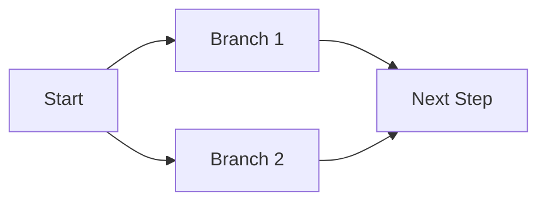
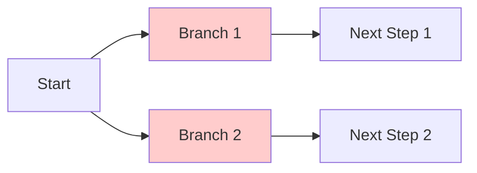
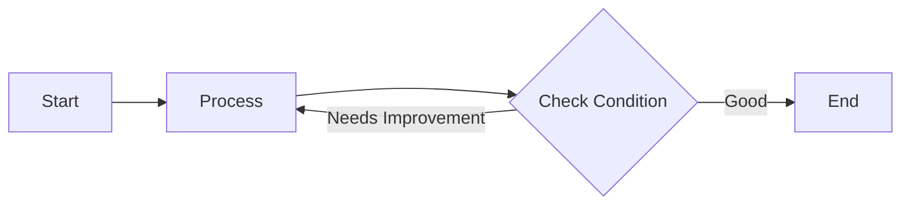
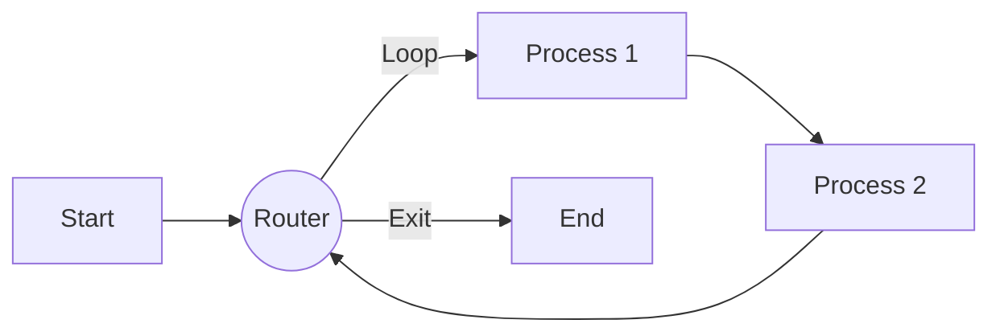

# Dynamic Graph Construction from Database

This tutorial demonstrates how to build a `StateGraph` dynamically based on configuration stored in a database. This pattern is useful when you want to allow users or administrators to define workflows at runtime without redeploying code.

## Concept

Instead of hardcoding the `StateGraph` structure in your Java code, you fetch node and edge definitions from a repository and construct the graph programmatically.

## Example Implementation

```java
@Service
public class DatabaseGraphLoader {

    // Registry of available actions (Bean Name -> NodeAction)
    private final Map<String, NodeAction> actionRegistry;

    public DatabaseGraphLoader(Map<String, NodeAction> actionRegistry) {
        this.actionRegistry = actionRegistry;
    }

    public CompiledGraph loadGraph(String workflowId) {
        // 1. Fetch config from DB
        List<NodeEntity> dbNodes = nodeRepository.findByWorkflowId(workflowId);
        List<EdgeEntity> dbEdges = edgeRepository.findByWorkflowId(workflowId);

        // 2. Initialize Graph
        StateGraph graph = new StateGraph(defaultKeyStrategy());

        // 3. Add Nodes dynamically
        for (NodeEntity node : dbNodes) {
            NodeAction action = actionRegistry.get(node.getActionType());
            if (action == null) throw new RuntimeException("Unknown action: " + node.getActionType());
            
            // Optional: Configure action with node.getConfig() JSON
            
            graph.addNode(node.getNodeId(), node_async(action));
        }

        // 4. Add Edges dynamically
        for (EdgeEntity edge : dbEdges) {
            if (edge.getCondition() == null) {
                // Simple Edge
                graph.addEdge(edge.getSourceNode(), edge.getTargetNode());
            } else {
                // Conditional Edge
                // You would need a registry for Condition functions too!
                graph.addConditionalEdges(
                    edge.getSourceNode(),
                    conditionRegistry.get(edge.getCondition()), 
                    Map.of("true", edge.getTargetNode(), "false", "END") // Simplified
                );
            }
        }

        // 5. Compile
        return graph.compile();
    }
}
```

## Topologies and Constraints

When designing your graph, it is critical to understand the supported topologies and the constraints enforced by the `CompiledGraph` engine.

### 1. Parallel Branching Constraint
The framework supports parallel execution (fan-out), but it enforces a strict **Convergence Constraint**:

> **All parallel branches must converge to the same single immediate target node.**

Failure to adhere to this will result in a `GraphStateException: parallel node [...] must have only one target`.

#### ✅ Valid Structure (Convergence)
Branches B and C both point to D. The compiler treats `A -> (B, C)` as a single `ParallelNode` that transitions to D.



#### ❌ Invalid Structure (Divergence)
Branches B and C point to different targets. The `ParallelNode` for A sees multiple targets (D and E) and throws an exception.



#### Solution: Use SubGraphs
To implement complex divergent flows, encapsulate the branches into **SubGraphs**.
*   **Subgraph X**: Contains the logic `B -> D`.
*   **Subgraph Y**: Contains the logic `C -> E`.
*   **Main Graph**: `A -> (Subgraph X, Subgraph Y) -> End`.
Both parallel branches (the subgraphs) now point to the same next node (e.g., proper execution end or a final join node).

### 2. Cyclical Graphs (Loops)
The framework fully supports cyclical graphs (loops), which are essential for agent behaviors like "Thought-Action-Observation" loops or iterative refinement.



#### Example: Multi-Node Loop
Complex cycles involving multiple nodes are also supported. For example, a "Router -> Process -> Review -> Router" loop.



**Implementation:**
```java
return new StateGraph(new HashMap<>())
    .addNode("start", new StartNode())
    .addNode("router", new RouterNode())
    .addNode("process1", new ProcessNode1())
    .addNode("process2", new ProcessNode2())
    .addEdge(START, "start")
    .addEdge("start", "router")
    // Conditional Edge for Decision
    .addConditionalEdges(
        "router", 
        state -> shouldContinueLoop(state) ? "loop" : "exit", 
        Map.of("loop", "process1", "exit", END)
    )
    // The Loop Flow
    .addEdge("process1", "process2")
    .addEdge("process2", "router") // Closes the cycle
    .compile();
```


#### Recursion Limit
To prevent infinite loops, the `CompiledGraph` enforces a **Recursion Limit** (default: 25 iterations). If the cycle repeats more than this limit, execution is halted with an error.

You can configure this limit using `compileConfig`:

```java
CompileConfig config = CompileConfig.builder()
    .recursionLimit(100) // Increase limit for long-running loops
    .build();
```